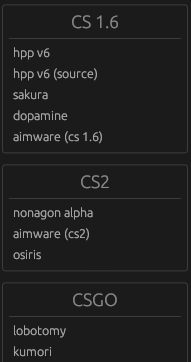

<div align="center">
   </img>
   <h1>unknproject</h1>
   unknproject is a simple loader for Counter-Strike game series using the egui library, written entirely in Rust.
</div>

## Showcase

<div align="center">
    
</div>

## Installation

To install unknproject, you can download [release](https://github.com/unknproject/unknproject/releases/latest), or build it by yourself!

## Usage

<details>
<summary>usage instructions</summary>

To use unknproject you need to download it from [github releases](https://github.com/unknproject/unknproject/releases/latest) or build it by yourself.

Next, you need to run the unknproject executable, and you will see the main window with the list of hacks.



1. Select the hack you want to inject from the list.
2. Click the "Inject" button.
3. Enjoy the game with the hack!

You can also drag and drop the DLL file onto the unknproject window to inject it into the game.

1. Drag and drop the DLL file onto the unknproject window.
2. Select the process you want to inject the DLL into.
3. Enjoy the game with your hack!

</details>

## Contributing

Contributions are welcome! Please open an issue or submit a pull request on GitHub.

### Build Instructions:

1. Clone the repository:

```sh
git clone https://github.com/unknproject/unknproject.git
cd unknproject
```

2. Setup nightly toolchain (for dll-syringe)

```sh
rustup toolchain install nightly
rustup default nightly
```

3. Build the project:

```sh
cargo build --release
```

## Credits

-   [egui](https://github.com/emilk/egui)
-   [dll-syringe](https://github.com/OpenByteDev/dll-syringe)
-   [egui-notify](https://github.com/ItsEthra/egui-notify)
-   [egui_alignments](https://github.com/a-littlebit/egui_alignments)
-   [egui-modal](https://github.com/n00kii/egui-modal)
-   [vdf_reader](https://github.com/icewind1991/vdf-reader)
-   [discord-rich-presence](https://github.com/vionya/discord-rich-presence)

## License

This project is licensed under the GPL 3.0 License. See the [LICENSE](https://github.com/unknproject/unknproject/blob/main/LICENSE) file for details.
